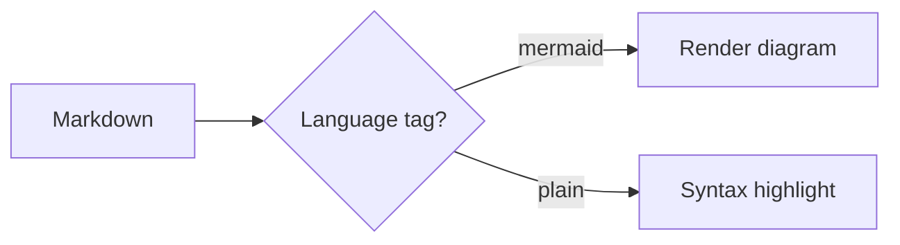

```bibliography
[
  {
    "id": "vaswani2017",
    "authors": "Ashish Vaswani, Noam Shazeer, Niki Parmar, et al.",
    "title": "Attention Is All You Need",
    "venue": "NeurIPS",
    "year": "2017",
    "url": "https://arxiv.org/abs/1706.03762"
  },
  {
    "id": "he2016",
    "authors": "Kaiming He, Xiangyu Zhang, Shaoqing Ren, Jian Sun",
    "title": "Deep Residual Learning for Image Recognition",
    "venue": "CVPR",
    "year": "2016",
    "url": "https://arxiv.org/abs/1512.03385"
  }
]
```

## Citations

The transformer architecture {{cite:vaswani2017}} changed sequence modeling, and residual connections {{cite:he2016}} made very deep networks trainable. Citing the transformer paper again {{cite:vaswani2017}} should reuse number [1], not create a new one.

## Equations

Inline math like $E = mc^2$ sits in a sentence. Block math stands alone:

$$
\left( \sum_{k=1}^n a_k b_k \right)^2 \leq \left( \sum_{k=1}^n a_k^2 \right) \left( \sum_{k=1}^n b_k^2 \right)
$$

## Footnotes

Here's a claim that needs a footnote.[^1] And another one.[^2]

[^1]: The first footnote body.

[^2]: The second footnote body, with **bold** text.

## Tables and task lists

| Feature       | Status | Notes          |
| ------------- | :----: | -------------- |
| Tables        |   ✅   | via remark-gfm |
| Strikethrough |   ✅   | ~~old text~~   |
| Task lists    |   ✅   | see below      |

- [x] Ship remark-gfm
- [ ] Ship the rest of the phases

## Raw HTML passthrough

<aside><p>This is a sidenote using the aside tag — floats into the right margin on desktop (Phase 2), stacks inline on mobile.</p></aside>

Some body text next to the sidenote above, so we can confirm the float doesn't collide with normal paragraph flow. More text to give the paragraph enough height to visually compare against the sidenote's position in the margin.

<details>
<summary>Click to expand</summary>

Hidden content, including `inline code` and a fenced block:

```python
def foo(x):
    return x * 2
```

</details>

## Layouts

Default body width (matches the text column):

<div class="l-body">This is .l-body — same width as the paragraph text.</div>

Slightly wider than body:

<div class="l-body-outset" style="background:#2F5D8A; color:#F1EFE8; padding:0.75rem 1rem; border-radius:0.75rem;">This is .l-body-outset — blue variant (#2F5D8A).</div>

Wider still, breaking into the margins:

<div class="l-page" style="background:#7A2E2E; color:#F1EFE8; padding:0.75rem 1rem; border-radius:0.75rem;">This is .l-page — maroon variant (#7A2E2E).</div>

<div class="l-page-outset" style="background:#8C6D1F; color:#F1EFE8; padding:0.75rem 1rem; border-radius:0.75rem;">This is .l-page-outset — muted yellow/ochre variant (#8C6D1F), distinct from the marker accent.</div>

Full viewport width:

<div class="l-screen" style="background:#2F5D8A; color:#F1EFE8; padding:0.75rem 1rem;">This is .l-screen (edge-to-edge) — blue variant again for comparison at full width.</div>

<div class="l-screen-inset" style="background:#7A2E2E; color:#F1EFE8; padding-top:0.75rem; padding-bottom:0.75rem;">This is .l-screen-inset (full width, padded in from the edge) — maroon variant again for comparison.</div>

## Inline Images

Default width, Markdown shorthand — should show a caption from `alt`:


Default width, plain `` tag with no class — should render identically, caption included:


Round 39 — a `photo-group` block, in a non-travel/non-review post body,
mixing an `img-large` tile with two `img-tall` tiles (3 photos total, so
should lay out 2-columns-then-3 responsively, not the full 4):

<div class="photo-group">


</div>

## Code Blocks

```python
def greet(name):
    # a comment
    return f"hello, {name}"
```

## Rich Content Blocks

### Mermaid



### Chart.js

```chartjs
{
  "type": "bar",
  "data": {
    "labels": ["2017", "2018", "2019", "2020", "2021"],
    "datasets": [
      {
        "label": "Population (millions)",
        "data": [12, 15, 13, 14, 16],
        "backgroundColor": "rgba(245, 197, 24, 0.6)",
        "borderColor": "rgba(245, 197, 24, 1)",
        "borderWidth": 1
      }
    ]
  },
  "options": { "scales": { "y": { "beginAtZero": true } } }
}
```

### ECharts

```echarts
{
  "title": { "text": "Monthly Sales", "left": "center" },
  "tooltip": { "trigger": "axis" },
  "xAxis": { "type": "category", "data": ["Jan", "Feb", "Mar", "Apr", "May"] },
  "yAxis": { "type": "value" },
  "series": [{ "data": [820, 932, 901, 934, 1290], "type": "line", "smooth": true }]
}
```

### Vega-Lite

```vega_lite
{
  "$schema": "https://vega.github.io/schema/vega-lite/v5.json",
  "description": "A simple bar chart",
  "data": {
    "values": [
      { "category": "A", "value": 28 },
      { "category": "B", "value": 55 },
      { "category": "C", "value": 43 }
    ]
  },
  "mark": "bar",
  "encoding": {
    "x": { "field": "category", "type": "nominal" },
    "y": { "field": "value", "type": "quantitative" }
  }
}
```

### Diff2Html

```diff2html
diff --git a/utils/mathUtils.js b/utils/mathUtils.js
index 3b5f3d1..c7f9b2e 100644
--- a/utils/mathUtils.js
+++ b/utils/mathUtils.js
@@ -1,5 +1,6 @@
-export function calculateArea(radius) {
-    const PI = 3.14159;
+export function calculateCircleMetrics(radius) {
+    const PI = Math.PI;
     const area = PI * radius ** 2;
+    return { area };
 }
```

### GeoJSON / Leaflet

```geojson
{
  "type": "Feature",
  "properties": {
    "name": "Nürnberg"
  },
  "geometry": {
    "type": "Point",
    "coordinates": [
      11.0767,
      49.4521
    ]
  }
}
```

### Typograms

```typograms
             ___________________
            /                  /|
           /__________________/ |
          |                  |  |
          |     Distill      |  |
          |                  |  |
          |                  | /
          |__________________|/
```

### Plotly (inline JSON)

```plotly
{
  "data": [{ "x": ["Q1", "Q2", "Q3", "Q4"], "y": [12, 19, 14, 21], "type": "bar" }],
  "layout": { "margin": { "t": 20 } }
}
```

### Plotly (static HTML export via iframe)

<div class="l-body">
  <iframe src="/assets/plotly/demo.html" frameborder="0" height="260" width="100%"></iframe>
</div>

### TikZ

Euler's formula $e^{i\theta} = \cos\theta + i\sin\theta$, drawn with TikZJax:

<script type="text/tikz">
\begin{tikzpicture}
    \filldraw[fill=cyan!10, draw=blue, thick] (0,0) circle (2cm);
    \draw[->, thick] (-2.5,0) -- (2.5,0) node[right] {Re};
    \draw[->, thick] (0,-2.5) -- (0,2.5) node[above] {Im};
    \draw[->, thick, color=purple] (0,0) -- (1.5,1.5);
    \node[color=purple] at (1.1, 1.7) {$e^{i\theta}$};
\end{tikzpicture}
</script>

## Closing section

A final heading to make sure the TOC has enough entries to scroll and test properly.
